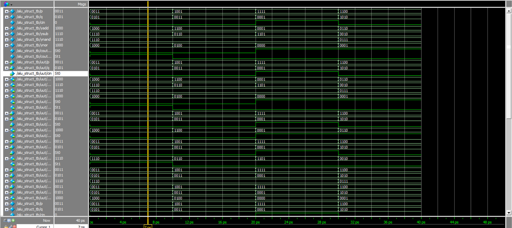
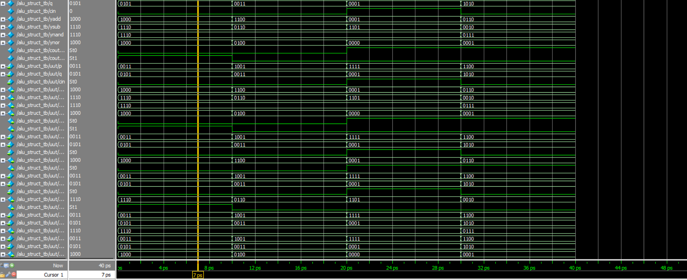
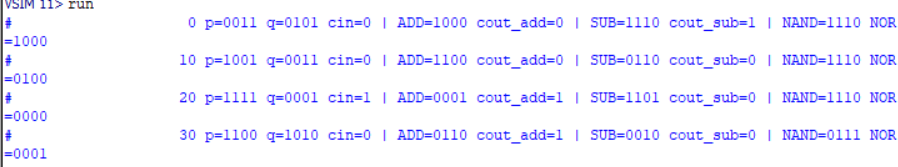
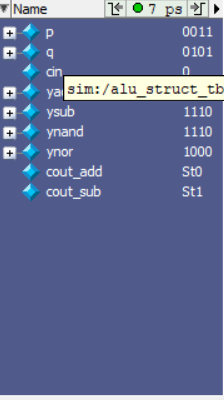

# 4-bit ALU in Verilog (Adder, Subtractor, NAND, NOR)

## What this does
- 4-bit **adder**, **subtractor**, **NAND**, **NOR**
- Structural top: `alu_struct`
- Testbench: `alu_struct_tb`

## How to simulate (ModelSim)
1. `vlog src/alu_struct.v src/alu_struct_tb.v`
2. `vsim alu_struct_tb`
3. `add wave -r *`
4. `run -all`

## Files
- `src/alu_struct.v` – DUT + submodules  
- `src/alu_struct_tb.v` – testbench  
- `screenshots/` – waveforms & console outputs

## Screenshots
Waveform:

Waveform:

Console run:

Wave detail:

